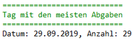

# Moodle Statistics

## Lehrziele

* Entity Framework Core 
* LINQ
* Muster: Repository und UnitOfWork

Unsere Lernplattform Moodle ermöglicht den Export der Log-Daten Ihrer Aktivitäten auf Moodle.

Ihre Aufgabe ist es, einen Teil dieser Log-Daten in einer SQL-Datenbank zu verwalten. Für den Core-Layer und die Persistenzschicht ist der Rahmen bereits angelegt.

## Core


Die Klasse `Pupil` verwaltet den Schüler über einen eindeutigen Namen. Eine Aufgabe hat einen Titel und wird in der Klasse `Exercise` verwaltet. Jede Aktivität eines Schülers wird mit einer Beschreibung und einem Zeitstempel versehen.

## ImportController

Die einzelnen Zeilen der csv-Datei sind so zu verdichten, dass am Schluss eine Collection von `Activities` mit ihren `Pupils` und `Exercises` zurückgegeben wird.

```
Import der Schüler und Abgaben in die Datenbank
===============================================
Datenbank löschen
Datenbank migrieren
Import der Actiivities, Pupils und Exercisesin die Datenbank
Activities werden von moodlestatistics.csv eingelesen
  Es wurden 2231 Aktivitäten eingelesen!
  Es wurden 6 Übungen eingelesen!
  Es wurden 28 Pupils eingelesen!
Daten werden in Datenbank gespeichert
```

## Persistence

Die Migration wurde bereits über die PM-Console angelegt: 

* ImportConsole als StartupProject 
* `Add-Migration InitialMigration`
* `UpdateDatabase` mit Kontrolle, ob DB angelegt wurde

Die Repositories müssen noch um die benötigten Methoden erweitert werden.

## ImportConsole (`MoodleStatistics.ImportConsole`) mit Analyse der Daten

Nach dem Import der Daten werden in der `ImportConsole` noch einige Statistiken/Kennzahlen errechnet:

### Auswertung 1


*Ausgabe der unterschiedlichen Aktivitätstexte. Sortierung nach dem Text* 

### Auswertung 2



*Bei gleicher Anzahl für mehrere Tage, ältestes Datum* 

### Auswertung 3


*Bei gleicher Anzahl für mehrere Schüler, jener, dessen Name im Alphabet vorne steht* 


### Auswertung 4


*Bei gleicher Anzahl für mehrere Aufgaben, jene, deren Titel im Alphabet vorne steht* 

### Auswertung 5


 Es ist für die einzelnen Schüler die Anzahl der gelesenen (`Activity.Description == "Kursmodul angezeigt"`) und der abgegebenen (`Activity.Description == "Eine Lösung wurde abgegeben."`) Aufgaben zu ermitteln. Das Ergebnis ist nach der Anzahl der Abgaben, der Anzahl der gelesenen Aufgaben und danach nach dem Namen zu sortieren.

Spezialisten (5% Bonus über 100%) zählen das Lesen und die Abgabe je Aufgabe nur einmal (rechte Tabelle)!

### Auswertung 6


Es sind jene 10 Abgaben zu ermitteln, deren Zeitspanne zwischen der ersten lesenden Aktivität (`"Kursmodul angezeigt"`) und der Letzten Abgabeaktivität (`"Eine Lösung wurde abgegeben."`) am kürzesten ist.